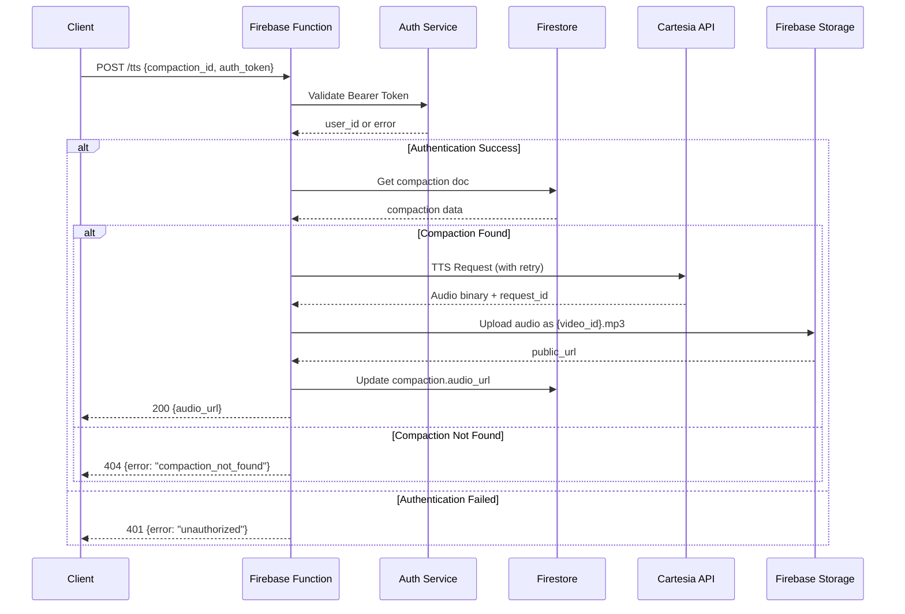

# Engineering Design: Cartesia TTS Firebase Function

**Branch:** main  
**GitHub Issue:** [#1](https://github.com/timfong888/cartesia-firebase-function/issues/1)  
**PRD:** [docs/prd-main-1.md](https://github.com/timfong888/cartesia-firebase-function/blob/main/docs/prd-main-1.md)

## System Overview
Firebase Cloud Function (Gen2, Node.js 22) that processes TTS requests using Cartesia API and stores audio in Firebase Storage.

## Architecture Components

### 1. Firebase Cloud Function
- **Runtime:** Node.js 22, Firebase Functions Gen2
- **Trigger:** HTTP POST endpoint
- **Authentication:** Bearer token validation
- **Secrets:** Cartesia API key via Firebase secrets

### 2. External Dependencies
- **Cartesia TTS API:** Text-to-speech conversion
- **Firebase Firestore:** Compaction document storage
- **Firebase Storage:** Audio file hosting
- **p-retry:** Exponential backoff retry logic

## Sequence Diagram



## Module Structure

```
functions/
├── src/
│   ├── index.js              # Main function entry
│   ├── auth/
│   │   └── validator.js      # Token validation
│   ├── firestore/
│   │   └── compaction.js     # Compaction CRUD operations
│   ├── cartesia/
│   │   └── tts.js           # TTS API client with retry
│   ├── storage/
│   │   └── uploader.js      # Firebase Storage operations
│   └── utils/
│       └── logger.js        # Structured logging
├── package.json
└── firebase.json
```

## Data Models

### Request Payload
```json
{
  "compaction_id": "string"
}
```

### Compaction Document (Firestore)
```json
{
  "compaction_text_human": "string",
  "voice_id": "string", 
  "video_id": "string",
  "audio_url": "string",
  "status_code": "number",
  "error": "string",
  "enumStatus": "processing|completed|failed"
}
```

### Cartesia TTS Request
```json
{
  "model_id": "sonic-2",
  "transcript": "compaction_text_human",
  "voice": {"mode": "id", "id": "voice_id"},
  "output_format": {
    "container": "mp3",
    "bit_rate": 128000,
    "sample_rate": 44100
  },
  "language": "en"
}
```

## Error Handling Strategy

### Passthrough and Log
The general principle is if there's an error, pass through back as a response AND as a log the error.

The code we write, if receiving an error from another service or third-party operation, should just pass that back in the final response and log.

For example, if uploading the binary to firebase store has an error from the firebase service, log:

- status code
- message
- function (`store-in-firebase`).
- 
### Authentication Errors
- **401:** Invalid/missing bearer token
- **Log:** `authentication_failure` with compaction_id

### Firestore Errors
- **404:** Compaction document not found
- **Log:** `compaction_not_found` with compaction_id
- **500:** Database connection issues

### Cartesia API Errors
- **Retry:** p-retry with exponential backoff (1min max for 2min audio)
- **Log:** `cartesia-tts-request` and `cartesia-tts-response`
- **Fallback:** Update compaction status to failed

### Storage Errors
- **500:** Upload failures
- **Log:** `store-in-firebase` with error details

## statusEnum Update in the CompactionDoc
Show the `compactionDoc.statusEnum` that changes at each key phase (function):

- tts-request: `start-tts`
- upload: `start-upload`
- update Compaction with `publicUrl` successful: `audioUrlDone`
- Any error, update `error`: error message
- `status_code`: error status code

## Logging Schema

### Structured Logs
```json
{
  "timestamp": "ISO8601",
  "level": "info|error",
  "event": "authentication_succeed|cartesia-tts-request|etc",
  "compaction_id": "string",
  "user_id": "string",
  "cartesia_request_id": "string",
  "file_size": "number",
  "public_url": "string",
  "error": "string"
}
```

## Security Model

### Authentication
- Bearer token in Authorization header
- Token validation extracts user_id
- No rate limiting (monitoring only)

### Storage Security
- Files stored as `{video_id}.mp3` in root bucket
- Publicly readable URLs
- Security through obscurity (video_id as filename)

## Configuration

### Google Secrets Management
- projects/648979367518/secrets/firebase-service-account
- projects/648979367518/secrets/cartesia_api_key
  
### Firebase Secrets
```bash
firebase functions:secrets:set CARTESIA_API_KEY
```

### Environment Variables
- `CARTESIA_API_URL`: https://api.cartesia.ai/tts/bytes
- `STORAGE_BUCKET`: Firebase project default bucket

## Deployment Steps

1. **Setup Firebase Project**
   ```bash
   npm install -g firebase-tools
   firebase init functions
   ```

2. **Configure Secrets**
   ```bash
   firebase functions:secrets:set CARTESIA_API_KEY
   ```

3. **Deploy Function**
   ```bash
   firebase deploy --only functions
   ```

## Testing Strategy

### Unit Tests
- Auth validation logic
- Cartesia API client
- Storage upload operations
- Error handling scenarios

### Integration Tests
- End-to-end request flow
- Retry mechanism validation
- Firestore operations

## Observability

### Metrics
- Request count and latency
- Cartesia API response times
- Storage upload success rates
- Error rates by type

### Alerts
- High error rates (>5%)
- Cartesia API failures
- Storage upload failures
- Function timeout issues
